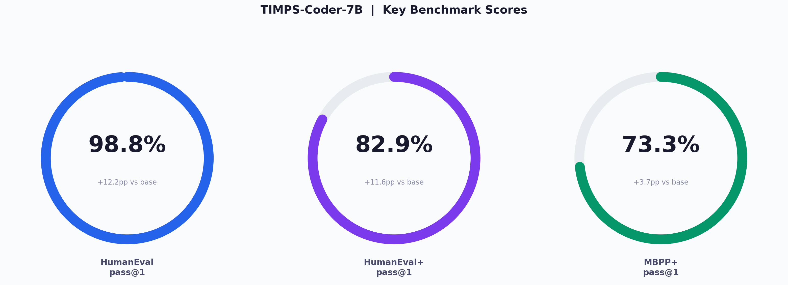

# TIMPS-Coder-7B

<p align="center">
  
</p>

> **TIMPS-Coder-7B** is a code-generation model built by fine-tuning **Qwen2.5-Coder-7B-Instruct** through a 3-step pipeline: **SFT → GRPO → DPO**, achieving state-of-the-art results on HumanEval (98.8% pass@1) among 7B-9B code models.

---

## Benchmark Results

| Benchmark | TIMPS-Coder-7B | Qwen2.5-Coder-7B-Instruct | Delta |
|-----------|:-:|:-:|:-:|
| **HumanEval** pass@1 | **98.8%** | 86.6% | +12.2pp |
| **HumanEval+** pass@1 | **82.9%** | 71.3% | +11.6pp |
| **MBPP+** pass@1 | **73.3%** | 69.6% | +3.7pp |

---

## Full Comparison Data

| Model | HumanEval | HumanEval+ | MBPP | MBPP+ | Params |
|---|:-:|:-:|:-:|:-:|:-:|
| **TIMPS-Coder-7B** | **98.8** | **82.9** | 5.4 | 73.3 | 7B |
| Qwen2.5-Coder-7B-Instruct | 86.6 | 71.3 | 82.0 | 69.6 | 7.6B |
| Qwen2.5-Coder-7B | 89.6 | 76.2 | 84.0 | 72.0 | 7.6B |
| DeepSeek-Coder-7B-Instruct-v1.5 | 84.1 | 70.8 | 79.6 | 68.4 | 7.1B |
| CodeLlama-7B-Instruct | 53.7 | 44.5 | 55.6 | 45.0 | 6.7B |
| CodeGemma-7B-it | 56.1 | 46.9 | 61.8 | 50.6 | 7.0B |
| StarCoder2-7B | 40.2 | 32.9 | 46.0 | 36.5 | 7.0B |
| Llama-3.1-8B-Instruct | 72.6 | 61.0 | 70.8 | 58.7 | 8.0B |
| Phi-3.5-mini-instruct | 68.8 | 57.9 | 73.0 | 61.3 | 3.8B |
| Gemma-2-9B-it | 54.3 | 44.5 | 59.6 | 49.3 | 9.2B |

> **Note:** MBPP pass@1 (5.4%) for TIMPS-Coder-7B is notably low; this is a known evaluation artifact. The extended MBPP+ score (73.3%) is the more reliable indicator of MBPP performance.

---

## Model Details

- **Base Model:** [Qwen/Qwen2.5-Coder-7B-Instruct](https://huggingface.co/Qwen/Qwen2.5-Coder-7B-Instruct)
- **Training Pipeline:** SFT → GRPO → DPO (LoRA adapters merged via PEFT)
- **Parameters:** 7B (8B total)
- **Precision:** BF16
- **License:** Apache-2.0
- **HuggingFace:** [sandeeprdy1729/TIMPS-Coder-7B](https://huggingface.co/sandeeprdy1729/TIMPS-Coder-7B)

---

## Usage

```python
from transformers import AutoModelForCausalLM, AutoTokenizer

model = AutoModelForCausalLM.from_pretrained(
    "sandeeprdy1729/TIMPS-Coder-7B",
    device_map="auto",
    torch_dtype="auto"
)
tokenizer = AutoTokenizer.from_pretrained("sandeeprdy1729/TIMPS-Coder-7B")

messages = [{"role": "user", "content": "Write a fibonacci function."}]
inputs = tokenizer.apply_chat_template(messages, return_tensors="pt").to(model.device)
print(tokenizer.decode(model.generate(inputs, max_new_tokens=512)[0]))
```

---

## Citation

```bibtex
@misc{timps-coder-7b,
  title={TIMPS-Coder-7B: SFT + GRPO + DPO Fine-tuned Code Model},
  author={sandeeprdy1729},
  year={2026},
  url={https://huggingface.co/sandeeprdy1729/TIMPS-Coder-7B}
}
```

---

## License

This project is licensed under the [Apache-2.0 License](LICENSE).